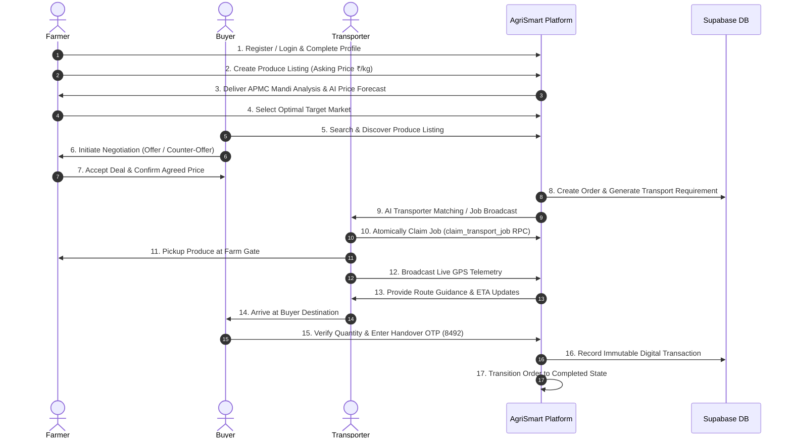

# GEMINI.md — AgriSmart Project Context & Architecture

## 1. Project Identity & Problem Statement
**AgriSmart (SIH26033 • AgriSmart AI Marketplace)** is an intelligent agricultural marketplace and multi-modal logistics coordination platform.

### Problem Context
In traditional agricultural supply chains, multi-tiered intermediary middlemen dilute farmer profits, inflate wholesale/retail consumer prices, create price opacity, and introduce uncoordinated logistics delays.

### Solution & Mission
AgriSmart eliminates middlemen friction by directly interconnecting three core stakeholders:
1. **Farmers**: Sell produce directly with real-time APMC Mandi market intelligence, price history graphs, and AI guidance.
2. **Wholesale Buyers & Retailers**: Discover vetted farmer listings, negotiate pricing directly through structured offers/counter-offers, and order with transparent logistics.
3. **Transporters**: Register commercial transport vehicles, claim delivery loads atomically, follow optimized corridors, broadcast live GPS telemetry, and complete verified OTP handovers.

---

## 2. Core Stakeholders & Personas

| Stakeholder | Core Goal | Primary Capabilities |
| :--- | :--- | :--- |
| **Farmer** | Maximize produce revenue & choose best selling markets | Produce listings, APMC Mandi price comparison, historical trends, order status, AI market guidance |
| **Buyer** | Source quality produce at fair negotiated wholesale rates | Search/filter marketplace, counter-offer negotiations, transport booking, live tracking, OTP confirmation |
| **Transporter** | Secure profitable freight jobs & minimize empty miles | Vehicle registry, atomic job claiming, route optimization, live GPS telemetry broadcast, proof-of-delivery |

---

## 3. Official Feature Scope (SIH26033)

AgriSmart implements **45 capabilities across 10 official feature groups**:
1. **Farmer Features**: Multi-channel auth, produce listings (commodity, variety, grade, quantity, asking price), market selection.
2. **Price & Market Analysis**: Real APMC Mandi price ingestion (data.gov.in API), price history visualizer, market-wise comparison, distance vs transportation cost analysis.
3. **Buyer Features**: Marketplace discovery, multi-parameter filtering, cart & checkout, order staging.
4. **Price Negotiation**: Dynamic offer / counter-offer engine, real-time message exchange, agreement finalization.
5. **Transporter Features**: Fleet/vehicle registry, capacity tracking, transport job feed, atomic claim procedure.
6. **Order & Connection**: Tri-party order graph linking farmer, buyer, and transporter with transparent lifecycle stages.
7. **Delivery & Live Tracking**: Real-time browser GPS telemetry, dynamic ETA calculation, corridor distance tracking, OTP receiver validation.
8. **AI Features**: AI demand prediction, AI price forecasting, AI market suggestions, smart match scoring, route recommendations.
9. **Delivery Optimization**: Multi-farmer load consolidation, mileage/fuel cost modeling, corridor optimization.
10. **Complete System Flow**: End-to-end tri-party workflow from harvest listing to verified digital handover.

---

## 4. End-to-End 17-Step Business Flow

---

## 5. Technical Architecture & Tech Stack

### Frontend
- **Framework**: Vite + React 18+ (TypeScript Strict Mode)
- **Styling**: Tailwind CSS + Lucide React icons
- **Routing**: React Router v7+ with route-level `React.lazy` and `Suspense`
- **Mapping & Geolocation**: Leaflet + React-Leaflet with browser `navigator.geolocation.watchPosition`
- **State Management**: Centralized `AppContext.tsx` with dedicated service-layer isolation

### Backend & Cloud (Supabase)
- **Database**: PostgreSQL with Row Level Security (RLS) policies
- **Authentication**: Supabase GoTrue (Email/Password & Google OAuth)
- **Edge Functions**: Deno TypeScript functions (`sync-mandi-prices`)
- **Realtime**: Supabase Realtime Channels for GPS telemetry and negotiations
- **Automation**: `pg_cron` for scheduled APMC Mandi synchronization

### External Integrations
- **Government Open Data**: data.gov.in APMC Mandi Resource `9ef84268-d588-465a-a308-a864a43d0070`
- **Unit Conversion**: ₹/quintal to ₹/kg ($\text{Price/kg} = \text{Price/quintal} \div 100$)

---

## 6. Database Schema & Security Model

### Primary Tables
- `public.profiles`: Base authentication profile and role assignment (`farmer`, `buyer`, `transporter`).
- `public.farmer_profiles`: Farm location, acreages, commodities grown.
- `public.buyer_profiles`: Business details, delivery address, buying preferences.
- `public.transporter_profiles`: Vehicle type, load capacity (kg), permit details.
- `public.market_prices`: Mandi price records ingested from data.gov.in.
- `public.orders`: Authoritative financial, state, and party-relationship ledger.
- `public.transporter_locations`: Real-time GPS coordinates stream linked to active orders.

### Security Defenses
- **RLS Policies**: Restrict user access strictly to their own profile, orders, and assigned jobs.
- **Triggers**: `enforce_order_integrity` protects order state and party relationships from unauthorized client mutation.
- **Atomic RPCs**: `claim_transport_job` locks the order row, preventing race conditions or duplicate claims.
- **Telemetry Protection**: Location inserts verify `auth.uid() == assigned_transporter_id`.

---

## 7. Financial & Pricing Formula

$$\text{Subtotal} = \text{Quantity (kg)} \times \text{Agreed Price (₹/kg)}$$
$$\text{Transport Cost} = \text{Distance (km)} \times \text{Transport Rate (₹/km)}$$
$$\text{Grand Total} = \text{Subtotal} + \text{Transport Cost} + \text{Protection/Escrow Fee}$$

*Example Demonstration Scenario:*
- Produce: 500 kg Red Onion @ ₹28.50/kg negotiated = ₹14,250
- Transport: 145 km @ ₹10/km = ₹1,450
- Protection Fee: ₹250
- **Total**: ₹15,950

---

## 8. Current Known Work Queue & Status

| Area | Status / Known Issue | Priority |
| :--- | :--- | :--- |
| **Market Comparison** | Search/filter query binding can return "No matching markets found" when data exists | High |
| **Price History / AI** | Red Onion context can display Tomato AI forecasts; forecast must bind to selected commodity | High |
| **Historical Messaging** | "Data still being collected" message conflicts with existing historical mandi data | Medium |
| **Brand Assets** | AgriSmart logo path/alt-text fix across layout headers | Medium |
| **Dashboard UX** | Hardcoded greetings ("Good morning, Ramesh") need dynamic profile hydration | Medium |
| **Live Tracking Layout**| Telemetry layout, assigned transporter cards, and status alignment polish | Medium |
| **Multi-Farmer Loads** | Consolidation engine for combining loads along shared transport corridors | Enhancement |
